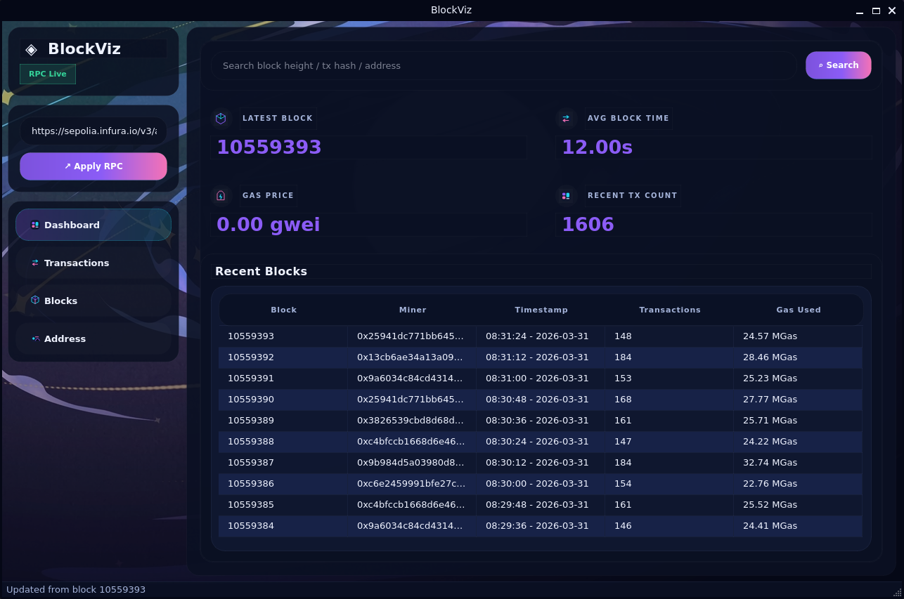

# BlockViz

BlockViz 是一个基于 PySide6 / Qt6 的桌面区块链浏览器，面向任何兼容 Ethereum JSON-RPC 的节点或服务。它把常见的区块、交易、地址查询整理成更适合桌面端使用的原生 UI，同时保留对链上原始数据的直接访问能力。

> BlockViz is a desktop blockchain explorer for Ethereum-compatible RPC endpoints, built with PySide6 and focused on native UI, fast inspection, and contract analysis workflows.



## ✨ Features

- **Dashboard 总览**：展示最近区块、平均出块时间、Gas Price、近期交易量，并自动轮询刷新。
- **全局搜索入口**：支持从 Dashboard 直接输入区块高度、交易哈希或地址，并跳转到对应页面。
- **Blocks 页面**：查看区块基础信息、头部哈希、Gas 使用情况，以及该区块内的交易列表。
- **Transactions 页面**：查看交易状态、费用、执行信息、签名字段 `v / r / s`，并保留原始 `Input Data` 复制能力。
- **Address 页面**：展示余额、Nonce / Tx Count、EOA / Contract 类型，并可查看合约字节码。
- **Heimdall 反编译**：若本机已安装 `heimdall-rs`，可直接对合约字节码执行反编译，并查看 `Bytecode`、`Source (Heimdall)`、`Source (AI)`、`ABI`。
- **AI 分析**：支持配置 OpenAI-compatible API，对 Heimdall 产出的源码进行可读性增强，且保留 Heimdall 原始结果。
- **后台任务处理**：RPC 连接、Dashboard 刷新、交易 / 区块 / 地址查询、模型拉取、反编译、AI 分析等耗时任务已转移到后台，尽量避免卡 UI。

## 🚀 Getting Started

### 1. 直接下载可执行文件
如果你只是想使用 BlockViz，最简单的方式是前往 [GitHub Releases](https://github.com/zysgmzb/BlockViz/releases) 下载对应平台的单文件程序：

- **Windows**：`BlockViz-windows-x64.exe`
- **macOS**：`BlockViz-macos`
- **Linux**：`BlockViz-linux-x64`

其中 macOS / Linux 下载后如无执行权限，可先执行：

```bash
chmod +x BlockViz-macos
chmod +x BlockViz-linux-x64
```

### 2. 从源码运行

```bash
git clone https://github.com/zysgmzb/BlockViz.git
cd BlockViz
python -m venv .venv
source .venv/bin/activate          # Windows PowerShell: .venv\Scripts\Activate.ps1
python -m pip install --upgrade pip
pip install -e .
python -m blockviz
```

安装为命令入口后，也可以直接运行：

```bash
blockviz
```

### 3. 首次启动
首次启动后，在左侧栏输入可用的 Ethereum JSON-RPC Endpoint，并点击 **Apply RPC**。

常见示例：
- 本地节点：`http://127.0.0.1:8545`
- Infura：`https://mainnet.infura.io/v3/<key>`
- Alchemy：`https://eth-mainnet.g.alchemy.com/v2/<key>`

连接成功后，Dashboard、Blocks、Transactions、Address 页面都会切换到当前 RPC 数据源。

## 🤖 Contract Analysis

### Heimdall 反编译
Address 页面中，当目标地址是合约地址时：

1. 先展示链上原始字节码；
2. 点击 **Decompile**；
3. 若本机存在 `heimdall-rs`，将生成以下结果：
   - `Bytecode`
   - `Source (Heimdall)`
   - `Source (AI)`（初始为空占位）
   - `ABI`

如果系统里没有 `heimdall-rs`，应用会直接提示，不会继续执行。

### AI Analysis
在完成 Heimdall 反编译后，可以配置 AI 设置并点击 **AI Analysis**：

- 支持 OpenAI-compatible API
- 支持 `API URL`、`API Key`、模型选择
- 支持可选代理 `Proxy`
- `Fetch Models` / `Test Connection` 已使用后台任务执行

## ⚙️ RPC & AI Config

### RPC 配置
| 方式 | 说明 |
| --- | --- |
| 侧栏输入 | 直接在应用左侧输入 RPC URL，并点击 `Apply RPC` |
| 环境变量 | 启动前设置 `BLOCKVIZ_RPC_URL=https://...` |
| 本地节点 | 默认值为 `http://127.0.0.1:8545`，适合本地开发节点 |

### AI 配置
AI 配置会持久化到用户本地配置文件中，当前包含：

- `ai_api_url`
- `ai_api_key`
- `ai_model`
- `ai_proxy`
- `ai_proxy_enabled`

## 🗂️ Project Layout

```text
BlockViz/
├── .github/workflows/release.yml   # GitHub Actions 构建 / 发布
├── BlockViz.spec                   # PyInstaller 打包配置
├── pyproject.toml                  # 项目元信息与依赖
├── scripts/package_entry.py        # 打包入口辅助脚本
├── src/blockviz/
│   ├── __init__.py
│   ├── __main__.py                 # python -m blockviz 入口
│   ├── app.py                      # QApplication 启动
│   ├── core/
│   │   └── config.py               # 本地配置持久化（RPC / AI）
│   ├── services/
│   │   ├── rpc_client.py           # Ethereum JSON-RPC 封装
│   │   ├── decompiler.py           # Heimdall 反编译封装
│   │   ├── ai_client.py            # OpenAI-compatible API 封装
│   │   └── mock_data.py            # 预留 / 测试数据
│   └── ui/
│       ├── main_window.py          # 主窗口与视图切换
│       ├── dashboard.py            # Dashboard 页面
│       ├── transactions.py         # Transactions 页面
│       ├── blocks.py               # Blocks 页面
│       ├── address.py              # Address 页面 + 反编译 / AI 分析
│       ├── ai_settings_dialog.py   # AI 设置对话框
│       ├── async_tasks.py          # 后台任务工具
│       ├── styles.py               # 全局样式与主题常量
│       └── widgets/
│           ├── sidebar.py          # 左侧栏
│           ├── search_bar.py       # 搜索栏组件
│           ├── info_card.py        # 指标卡片
│           ├── detail_section.py   # 详情区组件
│           └── icons.py            # SVG 图标
└── README.md
```

## 🧱 Architecture Notes

- **UI 层**：PySide6 + QSS，自定义深色风格，主窗口由 Sidebar + 多页面 Stack 组成。
- **服务层**：`rpc_client.py` 统一封装链上查询；`decompiler.py` 调 Heimdall；`ai_client.py` 调用兼容 OpenAI 的接口。
- **后台任务层**：`ui/async_tasks.py` 将阻塞式 RPC / AI / 反编译工作迁移到线程池，避免冻结 UI。
- **配置层**：`core/config.py` 将 RPC 与 AI 设置写入本地配置文件，重启后继续生效。

## 🧪 Development

安装开发依赖：

```bash
pip install -e ".[dev]"
```

如项目中已安装对应工具，可执行：

```bash
ruff check src
python3 -m compileall src
```

## 🗺️ Roadmap

- 更完善的交易 / 地址历史追踪与缓存策略
- 合约函数签名解析与 ABI 辅助展示
- 更丰富的链上统计视图
- 更细粒度的后台任务状态与进度展示

## 🤝 Contributing

欢迎提交 Issue / PR。建议在提交前说明：

1. 修改了什么；
2. 为什么这样改；
3. 如何验证；
4. 是否还有后续计划。

## 📄 License

本项目以 MIT License 发布，详见 `LICENSE`。
